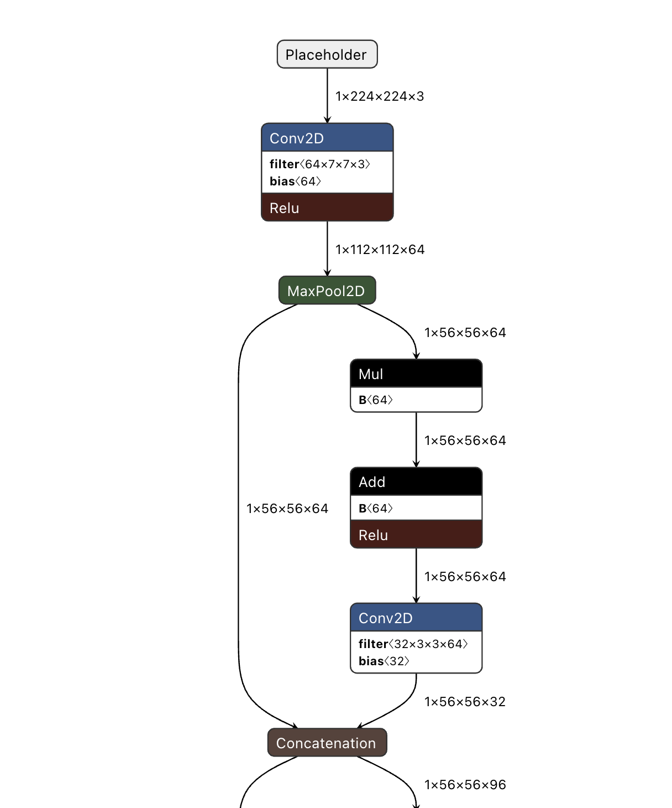
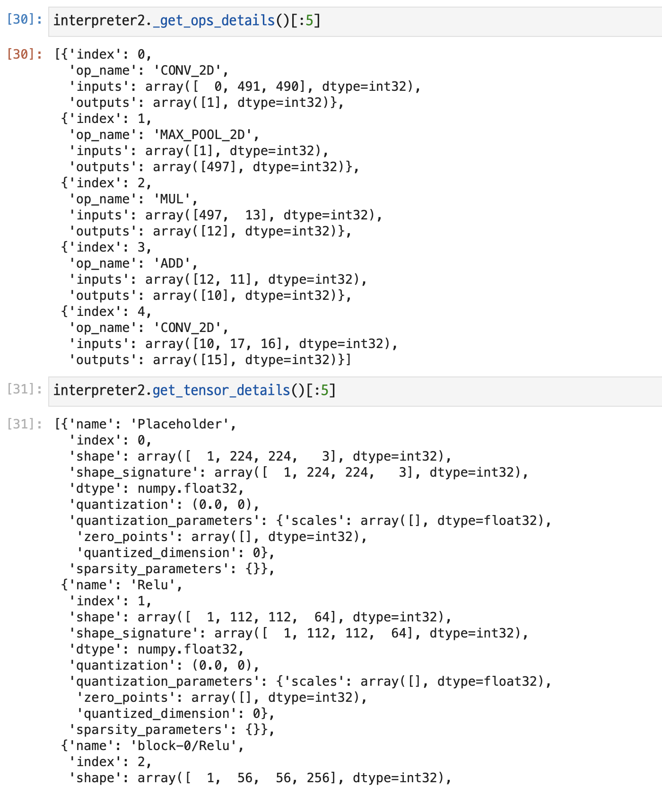

In this week, I tried to find out input/output size of each layers. Following is the example code from Ekaterina.

```c
  const tflite::Interpreter* interpreter = ...; // Initialize interpreter
  for (int op_index : interpreter->execution_plan()) {
    const auto* op_and_reg = interpreter->node_and_registration(op_index);
    if (op_and_reg->second.builtin_code == kTfLiteBuiltinConv2d) {
      // Parse operation basing on its type.
      // See other types in tensorflow/lite/builtin_ops.h
    }
    for (const auto input_idx :
         tflite::TfLiteIntArrayView(op_and_reg->first.inputs)) {
      // Access operation input using its index.
    }
    for (const auto output_idx :
         tflite::TfLiteIntArrayView(op_and_reg->first.outputs)) {
      // Access operation output using its index.
    }
  }
```

For starters, I wanted to change it to python version of code. I tried densenet at first which has no quantization. TFLite models can be downloaded [here](https://www.tensorflow.org/lite/guide/hosted_models?hl=ko). 

And Below is the first part of Densenet's Architecture.



I coded the following by referring tensorflow's [`interpreter.py`](https://github.com/tensorflow/tensorflow/blob/master/tensorflow/lite/python/interpreter.py) code. 


```python
import tensorflow as tf
SAVED_MODEL_PATH = "./MODLES/densenet.tflite"

interpreter = tf.lite.Interpreter(model_path=SAVED_MODEL_PATH)

for op_index in range(interpreter._interpreter.NumNodes()):
    op_and_reg = interpreter2._get_op_details(op_index)
    # to do.. 
```

`_get_op_details` function is experimental method, but anyway it returns all of layers sequentially. So I thought with this code, I could know the kind of each (like Conv2d, Maxpooling etc) and the input/output size of the layers. But It was not what I expected. 



`_get_ops_details` method let me know the order of each layer, but its input and output have numbers that I do not know what it means. 

BTW, `get_tensor_details()` function returns all of the tensors and It looks quite understandable numbers. But It doesn't retuns sequentially.


So In this week... What I would like to know is..

## To Check List

- [] What is `kTFLiteBuiltinConv2d`? Does it just mean 'this is Conv2D'?
- [] The Difference between `tensor` and `ops`(?)
